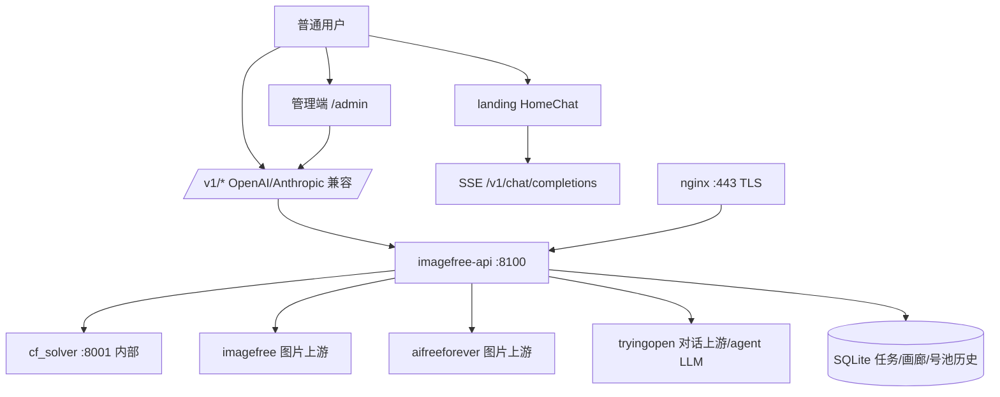

# 007-v20-platform-refactor Plan — 实施计划（Phase 4/5 补齐）

## 1. 背景与目标

v20 把产品重心从「多提供商逆向网关 + 运维后台」转向「平台化在线使用」：
下线维护成本最高的两个上游（nanobanana 号池签到 / fal.ai 视频反自动化），保留
imagefree + aifreeforever 图片、tryingopen 对话；落地页与管理端首页直接可对话；
agent（planner/critic/intent/memory）与聊天放开 tryingopen 真实调用。

三个 v20 commit（`102120f` / `49e4ae5` / `a9ac59c`）已推送 main 并打 Release v20.0.0
（远端 tag `v20.0.0` = `a9ac59c5e28d5e663392997a0b14ed7321717d30`），已部署到
https://imagefree.hwhcie.bond（nginx 443 → api 8100 + cfsolver 8001）。

## 2. 架构总览

- 提供商注册表收敛：`imagefree`（6 图）+ `aifreeforever`（19 图）+ `tryingopen`（24 对话），
  `nanobanana` / `falai` 域不再出现在 `/v1/providers`。
- 号池 `account_pool` 启动不再自动补号/每日签到，历史数据 `data/account_pool.db` 保留可查。
- 对话链路：`/v1/chat/completions`（OpenAI 兼容，含 SSE 流式）；`/v1/messages`（Anthropic 兼容）；
  `/v1/agent/dag/plan|run`（agent 编排，真实 LLM 或规则兜底）。

## 3. 组件清单

| 组件 | 位置 | 状态 |
|------|------|------|
| 提供商注册表（2 图 + 1 对话） | `api/providers/registry.py` | 完成 v20 |
| 下线 nanobanana/falai（config/脚本/测试/断言） | `api/providers/` `api/config/` `scripts/` `tests/` | 完成 v20 |
| 落地页 HomeChat（SSE 流式/骨架/空错态/重试/键盘/移动端） | `landing/src/components/HomeChat.vue` | 完成 v20（G4 浏览器验收待补） |
| 管理端首页 ChatPlayground + /dashboard + /chat 兼容 | `frontend/src/` | 完成 v20（G4 浏览器验收待补） |
| tryingopen 真实调用放开（IF_MOCK_UPSTREAM 默认 false） | `api/config/` `api/agent/` | 完成 v20（真机冒烟已过） |
| 文档/版本 bump/Release | `docs/` `README.md` `deploy/` | 完成 v20.0.0 已推送已发版 |
| 全量 E2E 回填（e2e_providers / e2e_v12 38 段） | `scripts/e2e_providers.py` `scripts/e2e_v12.py` | G2 待做 |
| Playwright 浏览器验收（流式/错误/移动端） | `frontend/e2e/` 或 `scripts/` | G4 待做 |
| 用户产品层（会话历史/配额/分享，可选） | `landing|frontend` + DB | G1 待做（阶段化，不阻塞 v20） |
| 视频新上游（falai 下线后开放项） | 另行 spec | G3 待做 |

## 4. 已完成实现的验证证据（截至 2026-09-26）

### 4.1 本地/构建类（v20 发行说明原始证据）

| 项 | 命令 | 结果 |
|----|------|------|
| 后端定向 pytest | 26 文件逐文件 | 26/27 全绿（`test_email_pool.py` 本机 180s 超时，另行单独重跑） |
| 前端 type-check | `tsc -b` | exit 0 |
| 前端定向 vitest | CommandPalette/ProvidersSort/CostsPage/Slow/i18n | 28/28 PASS |
| landing 构建 | `npm run build` | prod bundle 成功 |
| registry 启动冒烟 | `python -c "bootstrap()"` | providers=[imagefree,aifreeforever] chat=[tryingopen] |

### 4.2 线上真机探针（2026-09-26 复核，https://imagefree.hwhcie.bond）

| 探针 | 结果 | 证据 |
|------|------|------|
| `GET /`（landing） | 200，HTML 含 HomeChat/聊天/听风AI/tryingopen | 0.56s |
| `GET /admin` | 200 | 管理端可达 |
| `GET /v1/providers` | 200，items 仅 3 家（imagefree/aifreeforever/tryingopen），无 nanobanana/falai | healthy x2 + tryingopen |
| `GET /v1/models` | 200，49 个模型（6+19+24），tryingopen/anthropic/claude-sonnet-5 在列 | count=49 |
| `POST /v1/chat/completions`（非流式） | 200，真实回复含 `reasoning_content` + usage | ttfb 6.15s，glm-5.3-flash |
| `POST /v1/chat/completions`（stream=true） | 200，text/event-stream，逐 chunk + `data: [DONE]` | ttfb 2.63s |
| `POST /v1/agent/dag/plan` | 200（scene=image） | ttfb 11.3s |
| `GET /v1/account-pool` | 200 | 号池可查（下线后无强制槽位） |
| `POST /v1/generate`（imagefree/default） | 200 接收，终态 error：上游免费单任务并发护栏（DLQ 3 次重试耗尽） | 上游限流，非仓库 4xx |
| `POST /v1/generate`（aifreeforever/flux-schnell） | 200 接收，终态 error：上游 HTTP 403 Cloudflare | 上游反自动化 |
| `POST /v1/messages`（Anthropic） | 503 PROV.001 聊天提供商调用失败（复测 4 次不同载荷） | 与发行前记录不一致，列入 G2 复测定级 |
| `GET /v1/healthz` | 200，cf_solver up，imagefree/aifreeforever healthy | 生产健康 |

> 归纳：对话/SSE/agent plan/首页在线使用 = 真实闭环；**生图端点可达但免费上游
> 存在限流/护栏/Cloudflare 挡板**，Anthropic 端点在本次复核窗口为 503 —— 两项均须
> 在 G2 全量 E2E 与线上复核中回填并定级（区分「上游抖动」与「回归」）。

## 5. 剩余缺口与分阶段方案

### G1 用户产品层（可选项，不阻塞 v20 运行）
目标：会话历史/配额提示/分享导出。
- 阶段 P3-1：会话历史持久化评审（localStorage vs DB 表），保持匿名 Key 模式；
- 阶段 P3-2：`X-RateLimit-*` 响应头 → UI「剩余次数」气泡；
- 阶段 P3-3：对话导出（Markdown / 截图）。
验收：任一能力落地即配最小 vitest/Playwright，不引入付费/登录体系。

### G2 全量 E2E 回填（P0）
- 干净环境跑 `scripts/e2e_providers.py`（nanobanana/falai 不存在断言 + tryingopen 对话冒烟 + 号池看板）；
- 干净环境跑 `scripts/e2e_v12.py` 38 段（mock solver + e2e DB 清理 + openapi version==20.0.0）；
- 本机 `IF_MOCK_UPSTREAM=0` 真实 `/v1/chat/completions` + `/v1/agent/dag/plan` 冒烟；
- 定向 pytest 26 文件全绿 + `test_email_pool.py` 单独重跑 + ruff 0 + tsc/vitest/landing build；
- 线上复核：Anthropic `/v1/messages` 503 复测定级；生图受限记录为已知外部依赖。
验收：verification-log 回填一行，release notes 补「全量 E2E n/n」证据。

### G3 视频新上游（开放项）
- 候选清单：免费/低成本 txt2vid/img2vid 上游；
- 接入成本评估（账号/代理/反自动化集成）、失败回退与配额护栏；
- 独立 spec 立项，不塞进 v20 收尾。
验收：候选表 + 决策记录 ADR，无「选型即上线」伪闭环。

### G4 浏览器自动化验收（P1）
- Playwright（chromium，复用 2026-09-15 P1-14 既有探针套路）：
  - 落地页 HomeChat：流式渲染、模型切换、错误→重试、375/768 移动断点无横滚；
  - 管理端 `/` 聊天、`/dashboard`、`/chat` 兼容、明暗截图；
  - 截图归档 `.benchmarks/resp-shots/` 或 `frontend/artifacts/`。
验收：全部断言 e2e 通过并有截图证据；vitest exclude e2e/** 防串。

## 6. 阶段编排（Setup → Core → Integration → Polish → Verification）

| 阶段 | 内容 | 编号 |
|------|------|------|
| Setup | v20 三 commit 已完成项（下线/HomeChat/ChatPlayground/放开真实调用/文档发版） | T001-T006 |
| Core | G2 全量 E2E 回填（e2e_providers / e2e_v12 / 真实 LLM 冒烟） | T007-T009 |
| Core | 定向 pytest + 前端收尾 + ruff/版本门禁 | T010-T012 |
| Integration | G4 Playwright 浏览器验收 + 线上复核定级 | T013-T015 |
| Polish | G1 用户产品层（可选） | T016-T019 |
| Verification | 全量回填 verification-log + 文档台账同步 | T020-T021 |

## 7. 风险与回滚

| 风险 | 等级 | 缓解/回滚 |
|------|------|-----------|
| 免费上游生图护栏/403（imagefree 单任务并发、aifreeforever Cloudflare） | 中 | 属上游外部依赖；G2 记录为已知项；需要时降级路由/排队；不做破坏性改动 |
| Anthropic `/v1/messages` 本次 503 | 中 | 先复测定级（上游抖动 vs 回归）；回归则定位 tryingopen anthropic 适配层，最小修复 + 定向测试 |
| 下线上游后全量 E2E 未回填 | 高 | G2 P0 优先；未跑通前不发新 Release |
| HomeChat/管理端浏览器行为未自动化 | 中 | G4 Playwright 补验；手动兜底路径已有发行说明 |
| 号池历史数据误删 | 低 | 只读查询保留；不执行任何清理 |
| 本机 test_email_pool 超时 | 低 | 既有重负载限制（v19 指南 0.2 节），单独重跑，不并入全量 |
| 违反回滚边界 | 低 | 剩余任务只读写 007 目录 + 明确列出的验收脚本产物；仓库其余文件不动；git 零操作 |

## 8. 边界声明（本 plan 生效范围）

- 可写：`.specify/specs/007-v20-platform-refactor/`（本 plan/tasks/state/progress）。
- 其余仓库文件只允许**只读验收**（跑 E2E/vitest 产生的标准产物按既有约定落位）；
- 不 git add/commit/push；不删除号池/历史数据；不发新 Release（除非用户另行授权）。