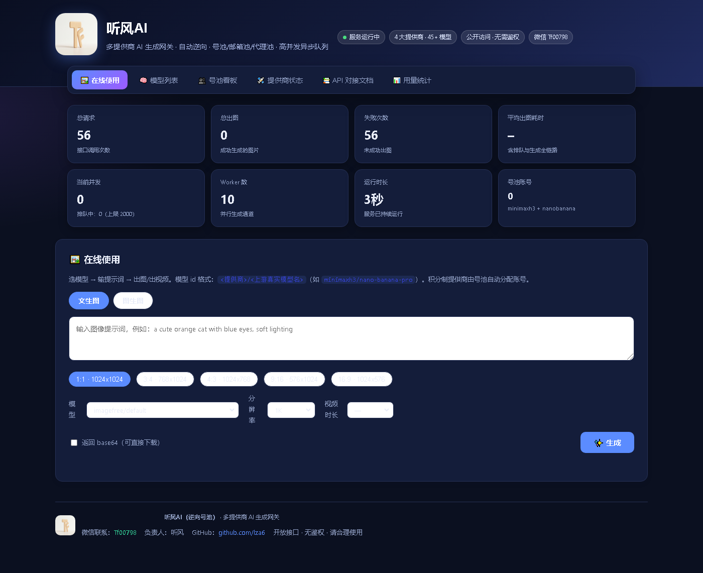
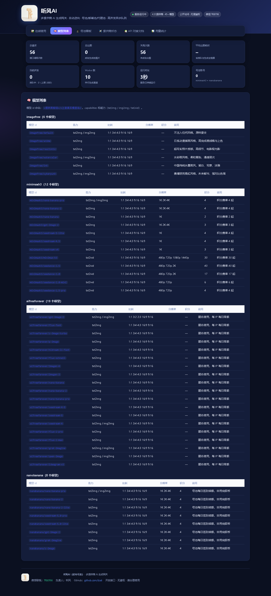
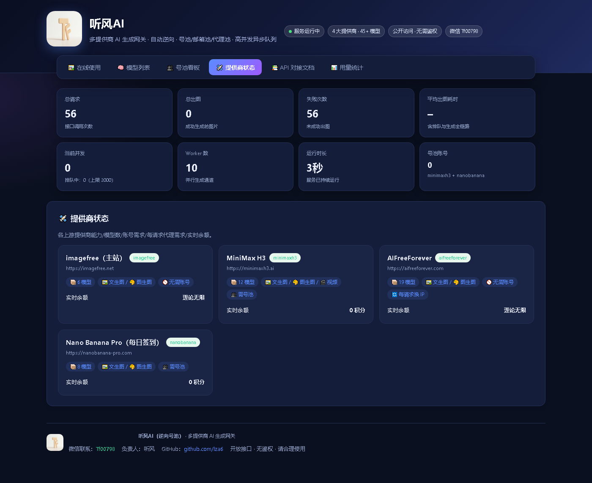
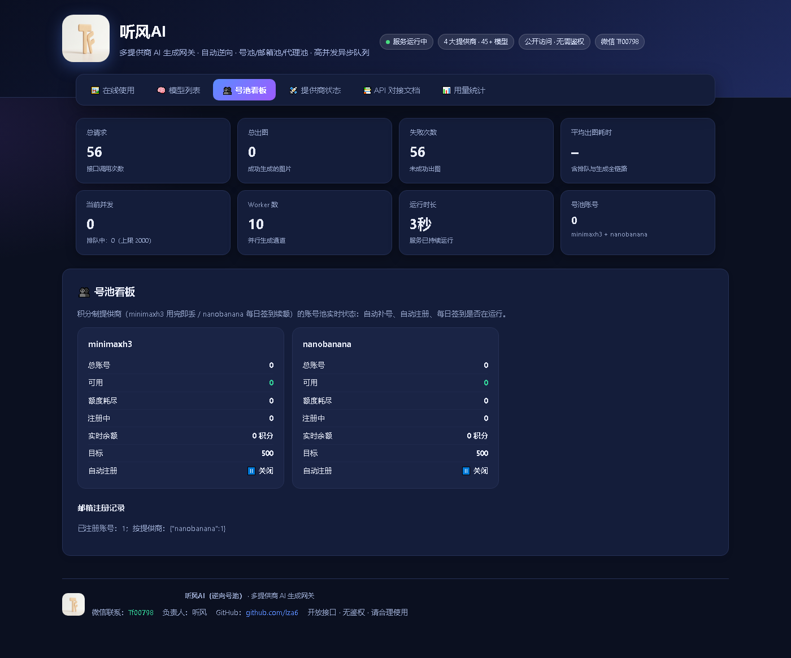
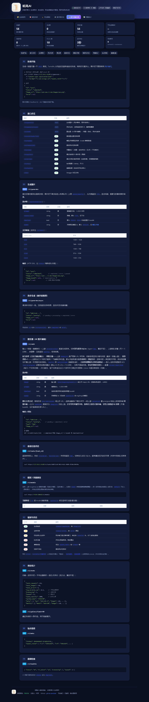

# 听风AI · 多提供商 AI 图像生成网关

> **逆向号池 + 自动注册 + 免费代理池 + 高并发异步队列** — 聚合多家 AI 图像生成站，统一 OpenAI 风格 API。




<p align="center">
  <a href="#"></a>
  <a href="#"></a>
  <a href="#"></a>
  <a href="#"></a>
</p>

---

## 📋 概述

听风AI 是一个**生产级 AI 图像生成 API 网关**，将多家上游 AI 图像服务（imagefree.net、aifreeforever.com、minimaxh3.ai、nanobanana-pro.com 等）聚合为统一的 OpenAI 风格 `/v1/*` 接口。核心能力包括：

- **🔄 多提供商路由** — 根据 model 参数自动路由到对应上游，支持自动降级/熔断
- **👥 号池自动化** — 自动注册 + 每日签到，管理 1000+ 账号无需人工干预
- **🌐 代理池轮换** — 住宅代理 + 免费代理双源，每 IP 递增冷却 + 24h 每日限额重置
- **⚡ 高并发架构** — 有界优先级队列 + Worker 池（4-16 自适应）+ Turnstile token 预取，扛 270+ RPS
- **🖥️ React 管理面板** — 独立 React 前端（/admin），图表化监控任务、提供商、号池、死信队列与实时日志
- **🔍 深度可观测性** — Prometheus 指标 + 审计日志 + 内置告警引擎 + WebSocket 实时日志 + OTel 分布式追踪
- **🔧 零鉴权部署** — 开箱即用，无需配置复杂鉴权；支持 Docker Compose 一键部署

> 📌 **线上演示**：https://imagefree.tingfengai.art（腾讯云东京，公益开放）

---

## 🚀 快速启动

### 前置依赖

- Python 3.11+ 或 Docker
- Node.js 18+（仅构建 React 管理面板时需要）
- 网络代理（访问 imagefree.net 等上游需能直连或通过代理）
- **cf_solver（Turnstile 求解器，端口 8001）** — 见下方「外部前置依赖说明」

> **外部前置依赖说明（cf_solver）**：本项目不内置 Turnstile 求解能力，cf_solver 是一个**独立复用的外部服务**，
> 来自同一开发者（听风）的 GPT 项目（`GPT自动化注册的项目/cf_solver`），核心是一个带 **camoufox 无头浏览器**
> 的求解服务，监听 `:8001`。它以 `boterdrop_wrapper.py` 启动（或 Docker 镜像 `imagefree-cfsolver`）。
>
> 没有 cf_solver 的影响：
> - **imagefree / aifreeforever 提供商无法出图** — 它们的上游用 Cloudflare Turnstile 人机验证，
>   token 必须由 cf_solver 实时求解
> - **minimaxh3 / nanobanana 号池自动注册失效** — 注册器同样依赖 Turnstile 求解
> - `/v1/healthz` 返回 `status: "degraded"`、`cf_solver: "down"`
>
> 启动方式（本地）：
> ```bash
> python cf_solver/boterdrop_wrapper.py &
> ```
> 或 Docker（随 compose 一起），cf_solver 需可访问目标站点（直连或代理），单浏览器槽≈5s/次求解。

### 方式一：Docker Compose（推荐）

```bash
# 注意：本仓库本地目录名为 imagefree-2ai，公开 GitHub 仓库为 Image-to-2api（lza6/Image-to-2api）
git clone https://github.com/lza6/Image-to-2api.git
cd Image-to-2api/deploy

# 编辑 docker-compose.yml 按需配置，然后启动
docker compose up -d
```

### 方式二：本地启动

```bash
# 1. 安装依赖
pip install -r requirements.txt

# 2. （可选）构建并挂载 React 管理面板
cd frontend
npm install
npm run build          # 产物输出到 frontend/dist，API 启动时自动挂载到 /admin
cd ..

# 3. 启动 cf_solver（Turnstile 求解服务）
python cf_solver/boterdrop_wrapper.py &

# 4. 启动 API 服务
uvicorn api.main:app --host 0.0.0.0 --port 8100
```

访问 `http://localhost:8100` 查看首页仪表盘，`http://localhost:8100/admin` 查看 React 管理面板。

> 前端开发模式（热更新）：`cd frontend && npm run dev`，Vite 代理将 `/v1` 与 `/metrics` 转发到 `127.0.0.1:8100`。

---

## 📸 截图

| 首页仪表盘 | 提供商状态 | 号池看板 |
|:---:|:---:|:---:|
|  |  |  |

| 模型列表 | API 文档 |
|:---:|:---:|
|  |  |

---

## 🏗️ 架构

```
调用方 ──POST /v1/generate ──► ┌──────────────────────────────────────────────────┐
   (同步/异步)                  │  imagefree_api (FastAPI :8100)                  │
                               │                                                   │
                         ┌─ 校验 ── SQLite 入库 ── 优先级队列(三级) ──┐          │
                         └────────────────────────────────────────────────────┘  │
                               │                                                   │
                           ┌───▼─────────┐   ┌──────────────────┐   ┌──────────┐ │
                           │ worker 池    │◄─┤ token 预取池     │◄─┤cf_solver │ │
                           │ (×10,自适应) │   │ (EMA延迟自适应)   │   │解Turnstile│ │
                           │ 4~16 auto   │   │ (熔断保护)        │   │(:8001)   │ │
                           └───┬─────────┘   └──────────────────┘   └──────────┘ │
                               │                                                   │
                               ├──► imagefree.net / aifreeforever / minimaxh3     │
                               │    nanobanana ... 统一 OpenAI 风格路由           │
                               │                                                   │
                               │   配套自动化：                                    │
                               │   ├─ 号池自动注册 + 每日签到                      │
                               │   ├─ 免费代理池抓取 + 住宅代理轮换               │
                               │   ├─ DB 批量写合并(0.2s窗口)                     │
                               │   ├─ 死信队列 + 重试退避 + 幂等提交              │
                               │   ├─ Prometheus 指标 + LRU 缓存                  │
                               │   └─ 管理面板 (/admin) + 告警/审计/日志/OTel     │
                               └──────────────────────────────────────────────────┘
```

### 核心设计

| 特性 | 说明 |
|------|------|
| **入口 50 RPS** | 请求仅做「校验→SQLite 入库→入队→返回」毫秒级，不阻塞 |
| **优先级队列** | 三级优先级（admin/paid/normal），各级独立容量上限 |
| **Worker 自适应** | 4-16 弹性伸缩，排队长则扩容，空闲则缩容 |
| **Token 预取池** | 后台持续预取 Turnstile token，请求零等待；EMA 自适应延迟 |
| **DB 批量写** | 0.2s 窗口合并 commit，50 RPS 下仅 ~5 commit/s |
| **base64 文件分离** | 图片 base64 从 SQLite 移至本地文件，到期自动清理 |
| **LRU 缓存** | 画廊/统计/提供商状态缓存，降低 DB 读压 |
| **熔断降级** | solver 连续失败达阈值→熔断 OPEN；provider 限流达阈值→自动降级 |
| **死信队列** | 重试耗尽的任务推入 DLQ，可在线查询/重试/清空 |
| **持久化队列** | 重启后未消费任务可续跑 |
| **内置告警引擎** | 规则评估 + 冷却抑制，无需外部 AlertManager，独立部署即可告警 |
| **审计日志** | 不可变仅追加，记录管理操作与状态变更，支持溯源 |

---

## ✨ 新增功能

### 🖥️ React 管理面板（/admin）

基于 **React 19 + TypeScript + Vite + Recharts** 的独立前端，构建产物 `frontend/dist` 由 FastAPI 自动挂载到 `/admin`（检测到目录即挂载，零额外配置）。

| 页面 | 说明 |
|------|------|
| **Dashboard** | 核心指标卡片 + 请求/生成趋势图表 + 统计概览 |
| **Tasks** | 任务列表（分页/筛选/排序），实时状态查看 |
| **Providers** | 提供商状态卡片，健康度一目了然 |
| **Accounts** | 号池看板，账号状态与配额 |
| **DLQ** | 死信队列在线查询、重试、清空 |
| **Logs** | WebSocket 实时日志流，浏览器直连 `/v1/logs/ws` |

前端开发模式（`npm run dev`）：Vite 代理 `/v1`、`/metrics` 至 `127.0.0.1:8100`。

### 📊 Prometheus 指标系统

`api/metrics_ext.py` 基于 **prometheus_client** 标准化 `/metrics` 输出（替代手写文本），统一 Counter / Histogram / Gauge 语义，可直接接入 Prometheus + Grafana：

- **Counter**：`imagefree_requests_total`、`imagefree_images_total`、`imagefree_errors_total`、`imagefree_solve_total`、`imagefree_solve_rejected_total`、`imagefree_token_wait_timeout_total`
- **Histogram**：`imagefree_generate_duration_seconds`（生成耗时）、`imagefree_solve_duration_seconds`（求解耗时）
- **Gauge**：`imagefree_processing`、`imagefree_queued`、`imagefree_token_pool_watermark`（按池）、`imagefree_db_rows`、`imagefree_edit_inflight`、`imagefree_uptime_seconds`、`imagefree_solve_window_success_rate`、`imagefree_solver_circuit_open`

### 📝 审计日志

`api/audit_log`（`api/audit.py`）— **不可变仅追加**审计，写入 `data/audit.log`（JSON Lines，UTC 时间戳），覆盖管理操作、配置文件变更、DLQ 重试/清空等行为，支持 `recent()` 在线回溯，满足安全溯源要求。

### 🚨 告警引擎

`api/alerting.py` — **内置轻量告警引擎**（无需外部 Prometheus + AlertManager），周期（`IF_ALERT_CHECK_INTERVAL`，默认 60s）评估规则，带冷却抑制（冷却期内不重复触发）与日志触达。

内置默认规则（可在代码中扩展）：

| 规则 | 级别 | 条件 |
|------|------|------|
| `queue_backlog` | warning | 排队任务数 > 1000 |
| `high_error_rate` | critical | 近 5 分钟窗口错误率 > 20% |
| `solver_circuit_open` | critical | 求解器熔断开启 ≥ 30s |
| `token_pool_empty` | warning | token 池空 > 10s |

### 🔌 WebSocket 实时日志

`/v1/logs/ws`（`api/log_ws.py`）— WebSocket 推送实时日志流。`WsLogHandler` 注入 root logger，**任何模块的日志自动广播到所有已连接客户端**，前端 Logs 页可零刷新观测；`LogBuffer` 保留最近 1000 条供快照回放。

### 🕵️ OpenTelemetry 深度追踪

`api/telemetry.py` — 基于 **OpenTelemetry** 的分布式追踪，`trace_id` 贯穿请求全生命周期（安全导入，未安装依赖时零开销降级）：

- **FastAPIInstrumentor** — 自动捕获 HTTP 请求→响应 span
- **HTTPXClientInstrumentor** — 自动捕获上游调用 span（imagefree.net / cf_solver）
- **LoggingInstrumentor** — 日志自动注入 `[trace=<hex_id>]`，日志/指标/追踪联动（O-04）

---

## 🔌 API 端点

| 端点 | 方法 | 说明 |
|------|------|------|
| `GET /` | — | 中文仪表盘首页（统计 + 画廊 + 实时状态） |
| `GET /admin` | — | React 管理面板（构建 dist 后可用） |
| `POST /v1/generate` | 同步 | 文生图/文生视频，阻塞直到出图 |
| `POST /v1/generate/async` | 异步 | 立即返回 task_id，轮询 `/v1/tasks/{id}` |
| `POST /v1/edit` | 异步 | 图生图（AI 照片编辑） |
| `GET /v1/tasks` | — | 任务列表（分页/筛选/排序） |
| `GET /v1/tasks/{id}` | — | 查询单任务结果 |
| `GET /v1/models` | — | 全提供商模型列表（45+ 模型） |
| `GET /v1/providers` | — | 提供商状态看板 |
| `GET /v1/stats` | — | 用量统计（按日/月拆分） |
| `GET /v1/gallery` | — | 最近作品画廊 |
| `GET /v1/healthz` | — | 健康检查 + solver 求解质量指标 |
| `GET /v1/logs` | — | 实时日志快照（环形缓冲区） |
| `GET /v1/logs/ws` | WebSocket | 实时日志推送流（订阅 root logger 广播） |
| `GET /v1/proxy-pool` | — | 代理池实时状态 |
| `GET /v1/account-pool` | — | 号池看板 |
| `GET /v1/dead-letter-queue` | — | 死信队列（查询/DLQ 重试、清空记入审计） |
| `GET /v1/meta` | — | sitekey / aspect_ratios 等元信息 |
| `GET /metrics` | — | Prometheus 指标（prometheus_client 标准格式） |
| `GET /docs` | — | Swagger 交互文档 |

### curl 示例

```bash
# 文生图（同步）
curl -X POST http://localhost:8100/v1/generate \
  -H "Content-Type: application/json" \
  -d '{"prompt":"a red rose","aspect_ratio":"1:1","download":true}'

# 文生图（异步）：立即返回 task_id，轮询 /v1/tasks/{id}
curl -X POST http://localhost:8100/v1/generate/async \
  -H "Content-Type: application/json" \
  -d '{"prompt":"a red rose","aspect_ratio":"1:1"}'

# 图生图（编辑，异步）
curl -X POST http://localhost:8100/v1/edit \
  -H "Content-Type: application/json" \
  -d '{"prompt":"make it a sunset","image_url":"https://example.com/photo.jpg"}'

# 模型列表（45+ 模型，4 提供商）
curl http://localhost:8100/v1/models

# 查询任务
curl http://localhost:8100/v1/tasks/{task_id}

# 拉取 Prometheus 指标
curl http://localhost:8100/metrics

# WebSocket 实时日志（wscat 客户端）
wscat -c ws://localhost:8100/v1/logs/ws
```

---

## 🧩 提供商清单

| 提供商 | 上游地址 | 能力 | 认证方式 | 风控 |
|--------|---------|------|---------|------|
| `imagefree` | imagefree.net | txt2img / img2img | Turnstile token | 直连 |
| `minimaxh3` | minimaxh3.ai | txt2img / img2img / txt2vid / img2vid | Auth.js cookie + 号池 | 用完即弃 |
| `aifreeforever` | aifreeforever.com | txt2img / img2img（≤3 参考图） | 匿名 + Turnstile | **每 IP 每日限额 → 每请求轮换代理** |
| `nanobanana` | nanobanana-pro.com | txt2img / img2img | better-auth cookie + 号池 | 每日签到续额 |

---

## ⚙️ 关键配置

| 环境变量 | 默认值 | 说明 |
|---------|--------|------|
| `IF_HOST` / `IF_PORT` | `127.0.0.1` / `8100` | 监听地址 |
| `IF_CF_SOLVER_URL` | `http://127.0.0.1:8001` | cf_solver 地址 |
| `IF_BASE_URL` | `https://imagefree.net` | 目标站点 |
| `IF_WORKERS` | `10` | Worker 并发数 |
| `IF_TOKEN_POOL_SIZE` | `6` | Token 预取池大小 |
| `IF_GENERATE_TIMEOUT` | `300` | 生成超时（秒） |
| `IF_TXT_RETRY_MAX` | `3` | 重试次数 |
| `IF_FREE_PROXY` | `0` | 免费代理池开关 |
| `IF_PROXY_FILE` | 空 | 住宅代理池文件 |
| `IF_ACCOUNT_AUTO` | `1` | 号池自动注册/签到 |
| `IF_GALLERY_PASSWORD` | 空 | 画廊密码 |
| `IF_DLQ_ENABLED` | `1` | 死信队列开关 |
| `IF_ALERT_CHECK_INTERVAL` | `60` | 告警引擎评估周期（秒） |

### 可观测性配置

| 环境变量 | 默认值 | 说明 |
|---------|--------|------|
| `IF_OTEL_ENABLED` | `0` | 是否启用 OpenTelemetry 追踪（依赖见 requirements.txt） |
| `IF_OTEL_SERVICE_NAME` | `imagefree-api` | OTel 服务名 |
| `IF_OTEL_EXPORTER_OTLP_ENDPOINT` | 空 | OTLP gRPC 导出目标（空 = 仅控制台输出） |

> 上表仅为常用变量（列出的约占全量的 1/4）。**完整环境变量列表见
> [`api/config.py`](api/config.py)（80+ 个，全部 IF_ 前缀）与
> [`deploy/.env.example`](deploy/.env.example)（92 项模板注释）。** 配置分组：
> 数据库 / HTTP / Turnstile 求解 / 多提供商号池 / token 池 / 队列 / 可观测性 / 图生图编辑 / 安全。

---

## 📁 项目结构

```
├── api/
│   ├── main.py              # FastAPI 入口 + 端点 + /admin 挂载
│   ├── config.py            # 配置（环境变量，含告警/OTel 项）
│   ├── worker.py            # 高并发引擎：优先级队列 + worker 池 + token 预取
│   ├── db.py                # SQLite 持久化 + 批量写合并
│   ├── turnstile_client.py  # cf_solver 客户端
│   ├── imagefree_client.py  # imagefree.net 客户端
│   ├── solver_guard.py      # 熔断器 + 求解质量统计
│   ├── proxy_pool.py        # 住宅代理池 + 冷却策略
│   ├── free_proxy_fetcher.py# 免费代理池抓取
│   ├── account_pool.py      # 号池管理
│   ├── registerer.py        # 自动注册（minimaxh3 / nanobanana）
│   ├── email_pool.py        # 注册邮箱池
│   ├── alerting.py          # 内置告警引擎（规则 + 冷却抑制）
│   ├── audit.py             # 不可变审计日志（JSON Lines，仅追加）
│   ├── log_ws.py            # WebSocket 实时日志推送 + LogBuffer
│   ├── metrics_ext.py       # prometheus_client 标准 /metrics
│   ├── telemetry.py         # OpenTelemetry 追踪（FastAPI/HTTPX/Logging）
│   ├── cache.py             # LRU 缓存
│   ├── cache_warmup.py      # 缓存预热
│   ├── errors.py            # 统一错误码体系
│   ├── health.py            # 健康检查聚合
│   ├── retry_policy.py      # 重试策略（指数退避 + jitter）
│   ├── base64_store.py      # base64 文件缓存
│   ├── log_buffer.py        # 日志环形缓冲
│   ├── context.py           # 请求上下文中间件（contextvars）
│   ├── providers/           # 多提供商适配器
│   │   ├── base.py          # 抽象基类
│   │   ├── registry.py      # 提供商注册 + 路由 + 健康检查
│   │   ├── imagefree.py
│   │   ├── aifreeforever.py
│   │   ├── minimaxh3.py
│   │   └── nanobanana.py
│   ├── static/              # 静态资源
│   └── docs.html            # 中文仪表盘首页
├── frontend/                # React 管理面板（构建到 dist 后由 API 挂载）
│   ├── src/
│   │   ├── pages/           # Dashboard / Tasks / Providers / Accounts / DLQ / Logs
│   │   └── components/      # StatCard / BarChart / ProviderCard / Gallery / Layout
│   ├── package.json         # React 19 + Vite + Recharts
│   └── vite.config.ts       # 开发代理 /v1、/metrics → 127.0.0.1:8100
├── tests/                   # 300+ 测试用例
├── deploy/                  # Docker Compose 部署资产
└── scripts/                 # E2E 验证 / 运维脚本
```

---

## 🔬 求解质量监控

前端仪表盘实时显示 cf_solver Turnstile 求解统计：

- **求解状态**：✅ 正常 / ⚠️ 劣化 / ⛔ 熔断
- **窗口成功率**：近 5 分钟滑动窗口成功率
- **累计统计**：总成功/失败次数、平均耗时
- **失败原因**：按原因分类（timeout / transport / solver_rejected / http_error）
- **Token 池水位**：直连池 + per-proxy 池水位
- **熔断状态**：连续失败达阈值自动暂停求解

后端 `/v1/healthz` 和 `/metrics` 暴露完整指标，可与 Prometheus + Grafana 集成；内置告警引擎可在无外部监控栈时独立触发告警。

---

## 🧪 测试

```bash
# 单元测试（300+ 用例）
pytest tests/ -q

# Mock E2E（零真实求解消耗）
python scripts/e2e_validate.py --mode mock

# 真实 E2E（需 cf_solver :8001 + 代理）
python scripts/e2e_validate.py --mode real
```

---
## 🧯 故障排查（Troubleshooting）

### healthz 返回 `status: "degraded"` 怎么办

`GET /v1/healthz` 聚合了以下状态，逐项查看返回体定位：

| 返回字段 | 含义 | 处理 |
|---------|------|------|
| `cf_solver: "down"` | cf_solver 8001 端口不通 | 见下方「cf_solver 不可用」 |
| `solver_status: "degraded"` | 求解成功但连续失败 > 0 | 观察 `solve_rejected_total`、`solve_consecutive_failures`，多半是上游风控/求解质量差，等窗口滑动自愈 |
| `solver_status: "circuit_open"` | 熔断开启（连续失败达阈值 `IF_SOLVE_CIRCUIT_THRESHOLD`，默认 5） | 熔断是保护性自动恢复，达 `IF_SOLVE_CIRCUIT_PROBE_SECONDS`（默认 30s）后自动探测恢复；若反复熔断需检查 cf_solver 与代理 |
| `token_pools` 水位全空 | token 预取池空 | 求解未跟上消耗，通常伴随 solver 不可用；排队会堆积 |
| `db_rows` 长时间不增长 | 请求没进来 | 检查队列是否满（429）或上游是否已熔断 |

> `status` 判据：`cf_solver` 探活失败 **或** `solver_status != ok` → `degraded`；
> 只有全部健康才返回 `ok`。`degraded` **不代表服务不可用**（内存/DB/worker 均正常），只是求解质量劣化。

### 生成失败常见原因

按 `error.code`（参见 [`api/errors.py`](api/errors.py) 错误码表）定位：

| 错误码 | HTTP | 含义 | 排查 |
|--------|------|------|------|
| `PROV.003` (SOLVER_CIRCUIT_OPEN) | 503 | 求解器熔断 | cf_solver 状态、代理质量、`solve_rejected_total` |
| `PROV.002` (OUT_OF_CREDITS) | 429 | 号池额度耗尽 | `/v1/account-pool` 看账号 `ok`/`credits`；minimaxh3 用完即弃，等补号循环；nanobanana 等签到 |
| `PROV.001` (PROVIDER_DOWN) | 503 | 上游不可用 | `/v1/providers` 看健康度；上游风控/维护 |
| `SYS.004` (TASK_TIMEOUT) | 408 | 生成超时（默认 `IF_SYNC_TIMEOUT=300s`） | 异步接口轮询 `/v1/tasks/{id}`；图生图上游极慢时调 `IF_EDIT_TIMEOUT` |
| `SYS.002` (QUEUE_FULL) | 429 | 队列满（上限 `IF_MAX_QUEUE=2000`） | 降并发；`/v1/healthz` 看 `queued`；扩队列或缩 worker |
| `VAL.001` (INVALID_MODEL) | 422 | model 名不对 | `GET /v1/models` 拿全量模型名，格式 `<提供商>/<模型>` |

其他高频隐形失败：
- **`Human verification failed` / `captcha_fail`**：token 与提交 IP 不匹配（带 `proxy` 求解时务必用同一代理提交；直连求解就用直连提交）或上游风控。
- **aifreeforever 每 IP 每日限额**：报 429/风控，需确保 `IF_FREE_PROXY=1`（免费代理池）或住宅代理兜底，冷却会自动递增并 24h 重置。
- **图生图 `edit` 卡在排队**：上游硬并发=1，`/v1/healthz` 看 `edit_inflight`；配 `IF_EDIT_PROXY_FILE` 多 IP 住宅代理 + `IF_EDIT_PROXY_PARALLEL>1` 才能绕过（免费数据中心代理会被 CF 403）。

### cf_solver 不可用如何排查

1. **先确认端口**：`curl http://127.0.0.1:8001/`。Docker 内用 `sudo docker logs -f imagefree-cfsolver`。
2. **健康依赖链**：cf_solver 用 camoufox 无头浏览器模拟求解 → 必须能访问目标站点（东京直连无需代理、本机走代理约 9-14s/次）。
3. **常见原因**：
   - cf_solver 进程没起 / 容器崩（OOM？cf_solver 限制 1.5G，每浏览器槽 ≈0.5-1GB）
   - 求解慢：`/v1/healthz` 的 `solve_avg_seconds` > 10s → 代理质量问题或 cf_solver 浏览器上下文被耗尽（`token_pools` 全部空）。要更高吞吐需加 cf_solver 浏览器槽（改 `cf_solver/config.json` 的 `thread`/`page_count`）
   - 求解失败但端口通：`solve_rejected_total` 持续增长 = 上游拒绝（风控/sitekey 过期），检查 `IF_SITEKEY` 是否被上游换新
4. **cf_solver 来源**：见「前置依赖」说明 —— 它是独立复用的外部服务（复用听风 GPT 项目的 cf_solver），不在本仓库内。

### 查看日志的方式

| 场景 | 命令 |
|------|------|
| 本地运行（前台） | 直接看终端；或 `curl 'http://127.0.0.1:8100/v1/logs?lines=200'` 拿环形缓冲快照 |
| Docker（api） | `sudo docker logs -f imagefree-api`（`json-file` driver，10m×3 滚动） |
| Docker（cfsolver） | `sudo docker logs -f imagefree-cfsolver` |
| 实时流 | 浏览器访问 `ws://127.0.0.1:8100/v1/logs/ws`（或 `wscat -c ws://...`），前端 `/admin` Logs 页零刷新 |
| 审计溯源 | 管理操作（DLQ 重试/清空/配置变更）写入 `data/audit.log`（JSON Lines，仅追加） |

日志格式：`2026-08-19 12:00:00 INFO <module> message [req=<id>] [trace=<id>]`（结构化，`req` 为请求 ID、`trace` 为 OTel trace_id，全链路可串联）。

### 常见 HTTP 错误码含义

| HTTP | 分层错误码 | 含义 |
|------|-----------|------|
| `400` | `VAL.004` | 参数错误（`details` 含具体原因） |
| `401` / `403` | `AUTH.001` | 未授权（若开启鉴权） |
| `404` | `SYS.003` | 资源不存在（任务 ID 过期/错误） |
| `408` | `SYS.004` | 同步等待超时（生成还在跑，用异步查任务） |
| `409` | `SYS.005` | 幂等 Key 冲突 |
| `413` | `VAL.004` | 请求体过大 |
| `422` | `VAL.001/2/3` | 模型/提示词/比例校验失败（FastAPI 校验错误也可能是 422） |
| `429` | `RATE.001` / `SYS.002` / `PROV.002` | 限流 / 队列满 / 号池额度耗尽 |
| `500` | `SYS.001` | 服务器内部错误 |
| `503` | `PROV.001/3` | 提供商不可用 / 求解器熔断 |

> 所有错误响应统一信封：`{"error": {"code": "CATEGORY.NNN", "message": "中文消息", "details": {...}}}`。
> 完整可重试语义：`429`/`503` 可退避重试；`4xx 校验类` 重试无意义。

---

## 📄 许可证

[MIT License](LICENSE) — 开源免费，欢迎使用、修改、再分发。

```
Copyright (c) 2026 听风AI

Permission is hereby granted, free of charge, to any person obtaining a copy
of this software and associated documentation files (the "Software"), to deal
in the Software without restriction, including without limitation the rights
to use, copy, modify, merge, publish, distribute, sublicense, and/or sell
copies of the Software, and to permit persons to whom the Software is
furnished to do so, subject to the following conditions...
```

---

## 🤝 联系

- 微信：**Tf00798**
- 负责人：**听风**
- GitHub：[@lza6](https://github.com/lza6)

---

> **免责声明**：本项目仅供学习和研究目的。使用本项目时请遵守相关法律法规和上游服务条款。