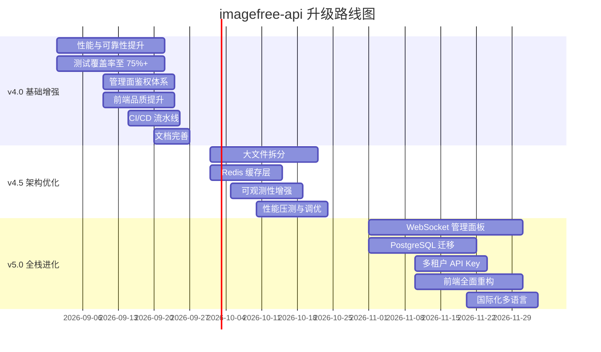
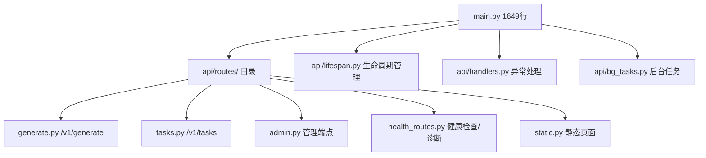
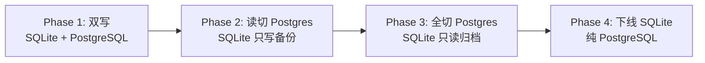
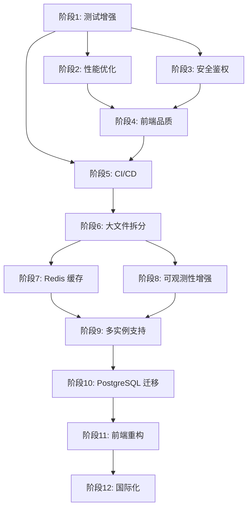

# 听风AI · 项目下一步改进指南（v3.1.0 → v4.0+）

> **版本基线**：v3.1.0（2026-08-23 发布）
> **目标版本**：v4.0 / v5.0 系列
> **文档创建**：2026-08-24
> **范围**：全栈全方位迭代升级（后端 API、前端管理面板、DevOps、架构、UX、安全、可观测性）

---

## 目录

1. [项目全景与现状分析](#1-项目全景与现状分析)
2. [版本升级路线图](#2-版本升级路线图)
3. [后端 API 核心升级](#3-后端-api-核心升级)
4. [前端管理面板全面重构](#4-前端管理面板全面重构)
5. [架构与基础设施升级](#5-架构与基础设施升级)
6. [安全与鉴权体系](#6-安全与鉴权体系)
7. [可观测性深度增强](#7-可观测性深度增强)
8. [性能优化专项](#8-性能优化专项)
9. [测试覆盖率与质量保障](#9-测试覆盖率与质量保障)
10. [DevOps 与部署流水线](#10-devops-与部署流水线)
11. [用户体验增强](#11-用户体验增强)
12. [技术债务清理](#12-技术债务清理)
13. [附录：升级顺序与依赖关系](#13-附录升级顺序与依赖关系)

---

## 1. 项目全景与现状分析

### 1.1 项目概况

| 维度 | 现状 |
|------|------|
| **版本** | v3.1.0 |
| **后端** | FastAPI + SQLite (aiosqlite) + httpx + pydantic-settings |
| **前端** | React 19 + TypeScript + Vite + Recharts |
| **部署** | Docker Compose（腾讯云东京） |
| **Python 代码量** | 11,145 行（api/）+ 10,444 行测试 |
| **前端代码量** | 1,208 行（src/） |
| **测试覆盖率** | ~55%（目标 ≥75% / ≥90%） |
| **核心功能** | 多提供商图像生成网关、号池自动化、代理池轮换、优先级队列、Turnstile 求解 |

### 1.2 已知痛点

| 问题 | 严重等级 | 影响 |
|------|---------|------|
| `api/main.py` 1649 行 | P2 高维护成本 | 违反编码规范，难以维护 |
| `api/config.py` 1026 行 | P2 高维护成本 | 配置分散，无分层分离 |
| `api/worker.py` 968 行 | P2 中 | 引擎层过重 |
| `api/db.py` 1087 行 | P2 高 | 数据库层过重，批量写逻辑复杂 |
| 测试覆盖率仅 55% | P1 高 | 回归风险大，重构信心不足 |
| 无管理面鉴权 | P2 中 | 生产环境暴露管理面板 |
| 无 API Key 体系 | P2 中 | 调用方无法独立鉴权 |
| 前端无暗黑模式 | P3 低 | 用户体验待提升 |
| 前端无响应式适配 | P3 低 | 移动端监控体验差 |
| 前端无多语言 | P3 低 | 暂不影响功能 |
| 部署无 CI/CD | P2 中 | 全手动部署，升级风险高 |
| SQLite 并发上限 | P1 高 | 高并发下写压力大 |
| 无缓存层（Redis） | P2 中 | LRU 缓存在内存，重启丢失 |
| 无消息队列备份 | P2 中 | 进程崩溃队列丢失 |
| 前端无 E2E 测试 | P2 中 | 改前端无回归保障 |
| 慢日志画像无告警集成 | P3 低 | 仅查看，无自动告警 |
| 无用户画像&使用统计 | P3 低 | 无法了解用户行为 |

### 1.3 核心优势（保留不重构）

| 优势 | 说明 |
|------|------|
| 异步全链路 | FastAPI + aiosqlite + httpx 全异步，非阻塞 IO |
| 优先级队列设计 | 三级队列 + 自适应 worker 池，架构清晰 |
| Turnstile token 预取 | EMA 自适应延迟 + 熔断保护，生产验证 |
| 批量写合并 | 0.2s 窗口合并 commit，50 RPS 下仅 ~5 commit/s |
| 号池自动化 | 自动注册 + 每日签到，维护成本极低 |
| 代理池双源 | 住宅代理 + 免费代理双源，轮换策略有效 |
| 内置告警引擎 | 轻量级告警，无需外部依赖 |
| 审计日志 | 不可变仅追加，可溯源 |
| 错误码体系 | 分层错误码 + 多语言消息 |
| 可观测性基础 | Prometheus 指标 + OTel 追踪 + WebSocket 日志 |

---

## 2. 版本升级路线图

### 2.1 总览



### 2.2 版本规划详表

| 版本 | 主题 | 主要内容 | 预期耗时 | 风险等级 |
|------|------|---------|---------|---------|
| v4.0 | 基础增强 | 性能优化、鉴权、测试、CI/CD、前端品质 | 3-4 周 | L2 中 |
| v4.5 | 架构优化 | 大文件拆分、Redis、可观测性、压测 | 3-4 周 | L2 中 |
| v5.0 | 全栈进化 | WebSocket 面板、PostgreSQL、多租户、前端重构 | 4-6 周 | L3 高 |

---

## 3. 后端 API 核心升级

### 3.1 P0：大文件拆分（v4.5）

**痛点**：`main.py`(1649行)、`config.py`(1026行)、`db.py`(1087行)、`worker.py`(968行) 均超规范。

**方案**：按功能域逐步拆分，不一次性大重构。

#### 3.1.1 main.py 拆分（高优先级）



**具体步骤**：

1. 提取 `api/routes/__init__.py` + `api/routes/generate.py`（生成类端点）
2. 提取 `api/routes/tasks.py`（任务查询类端点）
3. 提取 `api/routes/admin.py`（管理面端点：号池/代理池/DLQ/日志/诊断）
4. 提取 `api/routes/health.py`（健康检查/元信息）
5. 提取 `api/lifespan.py`（startup/shutdown 逻辑，含 `_run_background_tasks`）
6. 提取 `api/handlers.py`（全局异常处理器 + shutdown_phase）
7. 提取 `api/bg_tasks.py`（后台定期任务：清理、巡检、告警）

**验收标准**：
- `main.py` 降至 < 300 行
- 所有路由正常注册，端点不变
- 全量回归测试通过

#### 3.1.2 config.py 拆分（中优先级）

**方案**：每子配置独立文件，聚合导出。

```
api/config/
├── __init__.py      # 聚合导出 Settings 类
├── base.py          # Settings 基类 + 环境变量读取
├── db.py            # DBSettings
├── http.py          # HTTPSettings
├── solver.py        # SolverSettings
├── cache.py         # CacheSettings
├── provider.py      # ProviderSettings
├── pool.py          # PoolSettings
├── queue.py         # QueueSettings
├── observability.py # ObservabilitySettings
├── edit.py          # EditSettings
├── security.py      # SecuritySettings
```

**验收标准**：
- `from .config import config` 不变（兼容旧引用）
- 每文件 < 150 行
- 配置热加载支持（可选）

#### 3.1.3 db.py 拆分（中优先级）

```
api/db/
├── __init__.py      # 聚合导出 DB 类
├── core.py          # 连接管理、读写分离、批量写
├── queries.py       # 查询方法（tasks、stats、gallery）
├── cleanup.py       # 清理逻辑
├── batch.py         # 批量写入引擎
├── migration.py     # 数据库迁移管理
```

#### 3.1.4 worker.py 拆分（中优先级）

```
api/worker/
├── __init__.py      # 聚合导出 Engine 类
├── engine.py        # 核心引擎：队列、worker 池
├── token_pool.py    # Turnstile token 预取池管理
├── scale.py         # 自适应伸缩逻辑
├── retry.py         # 重试策略
```

### 3.2 P0：性能与可靠性提升（v4.0）

#### 3.2.1 SQLite 写性能优化

| 优化项 | 方案 | 预期收益 |
|--------|------|---------|
| WAL 模式确认 | 确保 `PRAGMA journal_mode=WAL` | 读写并发不阻塞 |
| 同步模式 | `PRAGMA synchronous=NORMAL` | 写性能提升 2-3x |
| 页面大小 | `PRAGMA page_size=16384` | 大对象读写更快 |
| 缓存大小 | `PRAGMA cache_size=-64000`（64MB） | 减少磁盘 IO |
| 临时存储 | `PRAGMA temp_store=MEMORY` | 临时表加速 |
| 外键约束 | 业务层控制，DB 层关闭 | 减少插入开销 |
| 单次写入合并 | 批量写窗口 0.2s → 0.5s | 降低 commit 频率 |

**代码实现**：

```python
# api/db.py 初始化时增加
async def _apply_pragmas(self):
    pragmas = [
        "PRAGMA journal_mode=WAL",
        "PRAGMA synchronous=NORMAL", 
        "PRAGMA page_size=16384",
        "PRAGMA cache_size=-64000",
        "PRAGMA temp_store=MEMORY",
        "PRAGMA busy_timeout=5000",
        "PRAGMA foreign_keys=OFF",
    ]
    for p in pragmas:
        await self._write_conn.execute(p)
```

#### 3.2.2 连接池优化

| 优化项 | 现状 | 优化后 |
|--------|------|--------|
| 写连接数 | 1 | 3（round-robin + 锁） |
| 读连接数 | 3 | 6-10（round-robin） |
| 连接超时 | 5s | 10s |
| 空闲回收 | 无 | 5 分钟空闲回收 |

#### 3.2.3 内存缓存层优化

| 缓存 | 现状 | 优化方案 |
|------|------|---------|
| LRU 缓存 | 128 条，TTL 5s | 512 条，TTL 分级（热点 30s，普通 5s） |
| 画廊缓存 | 单层 | 两级：LRU + 预加载 |
| 统计缓存 | 无 | 统计结果缓存 10s |
| 模型列表 | 每次实时采集 | 缓存 60s + 事件刷新 |

#### 3.2.4 队列持久化

**方案**：将内存队列与持久化队列深度整合，默认启用。

```python
# 启动时恢复未完成任务
async def _recover_pending(self):
    pending = await self._queue_db.get_pending()
    for task in pending:
        await self._queue.put(task)
```

**验收**：
- 进程重启后未完成任务自动续跑
- 集成测试覆盖 5 种场景（正常/异常/超时/取消/重启）

### 3.3 P1：Redis 缓存层（v4.5）

**动机**：当前内存 LRU 缓存重启丢失，无法跨进程共享。

**方案**：Redis 作为可选缓存后端，`IF_REDIS_ENABLED=1` 时启用。

```python
# api/cache_redis.py
class RedisCache:
    def __init__(self, url: str = "redis://localhost:6379/0"):
        self._redis = redis.asyncio.from_url(url)
    
    async def get(self, key: str) -> Any | None:
        val = await self._redis.get(f"imagefree:{key}")
        return pickle.loads(val) if val else None
    
    async def set(self, key: str, value: Any, ttl: int = 5):
        await self._redis.setex(f"imagefree:{key}", ttl, pickle.dumps(value))
```

**缓存项**：

| Key | 用途 | TTL |
|-----|------|-----|
| `stats:{period}` | 统计概览 | 10s |
| `gallery:{limit}` | 画廊列表 | 5s |
| `models` | 模型列表 | 60s |
| `providers` | 提供商状态 | 5s |
| `healthz` | 健康检查 | 5s |
| `diagnostics` | 只读诊断 | 5s |

**降级**：Redis 不可用时自动回退为内存 LRU。

### 3.4 P1：优先队列增强（v4.0）

| 增强项 | 描述 |
|--------|------|
| 队列监控 | 每级队列独立监控指标（入队速率、出队速率、排队时间分布） |
| 超时任务自动清理 | 排队超时（如 300s）自动取消并返回超时错误 |
| 优先级动态调整 | 同一任务排队超时后自动提升优先级 |
| 队列告警 | 任一级队列使用率 > 80% 触发告警 |
| 速率限制 | 每级队列独立速率限制（令牌桶算法） |

### 3.5 P1：号池升级（v4.5）

| 特性 | 现状 | 目标 |
|------|------|------|
| 账号评分 | MAB EMA 评分 | 多维度评分（延迟/成功率/剩余额度/注册时间） |
| 自动补号 | 固定阈值 | 动态阈值（根据消耗速率自动调整） |
| 签到策略 | 每天全部签到 | 智能签到（按余额分级，低于阈值才签） |
| 账号健康度 | 二进制（可用/不可用） | 多级健康（活跃/降级/冻结/耗尽） |
| 风控策略 | 无 | 登录频率限制、IP 轮换、行为模拟 |
| 多邮箱源 | 3 个 | 可插拔邮箱源插件架构 |

### 3.6 P1：图生图（Edit）增强（v4.5）

| 特性 | 现状 | 目标 |
|------|------|------|
| 并发控制 | 互斥锁单任务 | 同账号串行，不同账号并行 |
| 超时策略 | 固定 480s | 自适应超时（基于历史耗时 x 2） |
| 代理绑定 | 单个代理池 | 每账号独立代理绑定 |
| 进度反馈 | 无 | 支持 SSE 或 WebSocket 进度推送 |
| 重试策略 | 固定间隔 | 指数退避 + 抖动 |

---

## 4. 前端管理面板全面重构

### 4.1 设计系统建立（v4.0）

**目标**：统一视觉语言，告别手写 style 内联样式。

```scss
// frontend/src/styles/tokens.css
:root {
  // 颜色系统
  --color-primary: #6b8aff;
  --color-primary-hover: #5a75e8;
  --color-success: #10b981;
  --color-warning: #f59e0b;
  --color-danger: #ef4444;
  --color-info: #3b82f6;
  
  // 语义色
  --color-bg: #f4f6fa;
  --color-bg-card: #ffffff;
  --color-bg-sidebar: #1a1e2e;
  --color-text: #1f2430;
  --color-text-secondary: #6b7280;
  --color-border: #d1d5e0;
  
  // 暗色模式
  --color-bg-dark: #121420;
  --color-bg-card-dark: #1e2132;
  --color-text-dark: #e1e4ed;
  --color-border-dark: #2d3050;
  
  // 圆角
  --radius-sm: 6px;
  --radius-md: 8px;
  --radius-lg: 12px;
  --radius-xl: 16px;
  
  // 阴影
  --shadow-sm: 0 1px 3px rgba(0,0,0,0.06);
  --shadow-md: 0 4px 12px rgba(0,0,0,0.08);
  --shadow-lg: 0 8px 24px rgba(0,0,0,0.12);
  
  // 间距
  --space-xs: 4px;
  --space-sm: 8px;
  --space-md: 12px;
  --space-lg: 16px;
  --space-xl: 24px;
  
  // 字体
  --font-mono: 'SF Mono', 'Fira Code', 'Cascadia Code', monospace;
  --font-sans: -apple-system, BlinkMacSystemFont, 'Segoe UI', system-ui, sans-serif;
  
  // 动画
  --transition-fast: 150ms ease;
  --transition-normal: 250ms ease;
}
```

### 4.2 UI 组件库（v4.0）

**目标**：抽取可复用组件，减少重复样式代码。

| 组件 | 用途 | 状态 |
|------|------|------|
| `Button` | 多种样式的按钮 | 新增 |
| `Card` | 通用卡片容器 | 新增 |
| `Table` | 通用表格（排序/筛选/分页） | 重构 |
| `Modal` | 模态对话框 | 新增 |
| `Tooltip` | 提示信息 | 新增 |
| `Badge` | 标签/徽章 | 新增 |
| `Select` | 下拉选择器 | 新增 |
| `Input` | 输入框 | 新增 |
| `Toggle` | 开关 | 新增 |
| `Tabs` | 标签页 | 新增 |
| `Pagination` | 分页组件 | 新增 |
| `Spinner` | 加载指示器 | 新增 |
| `ProgressBar` | 进度条 | 新增 |
| `Alert` | 提示条 | 新增 |
| `Dropdown` | 下拉菜单 | 新增 |

### 4.3 暗黑模式（v4.0）

**方案**：CSS 变量 + `prefers-color-scheme` + 手动切换。

```typescript
// frontend/src/hooks/useTheme.ts
export function useTheme() {
  const [theme, setTheme] = useState<'light' | 'dark'>(() => {
    const stored = localStorage.getItem('theme');
    if (stored === 'light' || stored === 'dark') return stored;
    return window.matchMedia('(prefers-color-scheme: dark)').matches ? 'dark' : 'light';
  });
  
  useEffect(() => {
    document.documentElement.setAttribute('data-theme', theme);
    localStorage.setItem('theme', theme);
  }, [theme]);
  
  const toggle = () => setTheme(t => t === 'light' ? 'dark' : 'light');
  return { theme, toggle };
}
```

### 4.4 响应式布局增强（v4.0）

**现状**：移动端侧边栏折叠，但主要内容区未适配。

**优化**：

| 断点 | 布局 | 行为 |
|------|------|------|
| < 480px | 底部导航栏 | 侧边栏转为底部 Tab 栏 |
| 480-768px | 折叠侧边栏 | 汉堡菜单展开 |
| 768-1024px | 窄侧边栏 | 图标 + 文字简写 |
| > 1024px | 全宽侧边栏 | 完整导航 |

### 4.5 新页面/功能增强（v4.0）

#### 4.5.1 实时仪表盘增强

| 卡片 | 数据源 | 刷新频率 |
|------|--------|---------|
| 请求速率 (RPS) 实时曲线 | `/v1/stats` | 3s |
| 错误率实时曲线 | `/v1/stats` | 3s |
| 各提供商成功率 | `/v1/providers` | 10s |
| 各队列深度 | `/v1/diagnostics` | 5s |
| Token 池水位 | `/v1/diagnostics` | 5s |
| 系统资源 (CPU/内存) | 后端采集 | 15s |
| 号池填充进度 | `/v1/account-pool` | 15s |

#### 4.5.2 提供商详情页

- 提供商历史健康趋势图（折线图，24h/7d/30d）
- 提供商时延分布（P50/P90/P99 分位图）
- 模型列表及状态
- 近期错误列表
- 手动触发健康检查按钮

#### 4.5.3 号池增强

- 历史账号数量趋势图（折线图）
- 账号详情（点击展开）
- 账号注册日志
- 手动注册触发
- 账号筛选（按状态/提供商/注册时间）

#### 4.5.4 前端 WebSocket 增强

**现状**：仅日志页面使用 WebSocket。

**扩展**：

| 通道 | 数据 | 用途 |
|------|------|------|
| `/v1/ws/stats` | 实时统计推送 | 仪表盘实时更新 |
| `/v1/ws/tasks` | 任务状态变更 | 任务列表实时更新 |
| `/v1/ws/alerts` | 告警推送 | 全局告警通知 |
| `/v1/ws/providers` | 提供商状态变更 | 提供商状态实时更新 |

**实现**：基于单 WebSocket 连接 + 通道订阅模式。

```typescript
// frontend/src/hooks/useWebSocketChannel.ts
interface WsMessage {
  channel: string;
  event: string;
  data: unknown;
}

export function useWebSocketChannel(channel: string) {
  const [data, setData] = useState<unknown>(null);
  const wsRef = useRef<WebSocket | null>(null);
  
  useEffect(() => {
    const ws = new WebSocket(`${location.protocol === 'https:' ? 'wss:' : 'ws:'}//${location.host}/v1/ws`);
    ws.onmessage = (e) => {
      const msg: WsMessage = JSON.parse(e.data);
      if (msg.channel === channel) setData(msg.data);
    };
    wsRef.current = ws;
    return () => ws.close();
  }, [channel]);
  
  return data;
}
```

### 4.6 图表与可视化增强（v4.5）

**现状**：仅一个柱状图（Recharts）。

**增强方案**：

| 图表类型 | 用途 | 库 |
|---------|------|------|
| 折线图 | 时序数据（RPS、错误率、延迟） | Recharts 增强 |
| 堆叠面积图 | 各提供商请求分布 | Recharts 增强 |
| 热力图 | 请求按小时/天分布 | 自绘或 ECharts |
| 饼图 | 错误类型分布 | Recharts |
| 仪表盘 | 队列水位、Token 池 | 自绘 SVG |
| 瀑布图 | 请求各阶段耗时 | 自绘 |
| 桑基图 | 请求流转路径 | ECharts |

### 4.7 前端性能优化（v4.5）

| 优化项 | 方案 | 预期收益 |
|--------|------|---------|
| 代码分割 | 路由级懒加载（已有）+ 组件级懒加载 | 首屏 JS 减少 30% |
| 虚拟列表 | 任务列表 > 100 条启用虚拟滚动 | 渲染性能提升 10x |
| 数据缓存 | SWR 模式（useApi 已有）+ 本地缓存 | 减少 API 请求 50% |
| 图片懒加载 | 画廊图片 IntersectionObserver 加载 | 首屏加载减少 80% |
| 请求节流 | 高频轮询接口（如 stats）使用 3s 节流 | 减少后端压力 |
| Bundle 分析 | 持续追踪 bundle 大小 | 防止 bundle 膨胀 |

---

## 5. 架构与基础设施升级

### 5.1 P0：PostgreSQL 迁移（v5.0）

**动机**：SQLite 在高并发写入场景遇到瓶颈，PostgreSQL 的 MVCC + 连接池天然适合多 worker 并发。

**迁移策略**：渐进式双写，不一次性切换。



**双写实现**：

```python
# api/db_migration.py
class DualWriteDB:
    def __init__(self):
        self._sqlite = DB(config.DB_FILE)
        self._pg: PsqlDB | None = None
    
    async def start(self):
        await self._sqlite.start()
        if config.IF_PG_ENABLED:
            self._pg = PsqlDB(config.IF_PG_DSN)
            await self._pg.start()
    
    async def insert_task(self, task: dict):
        await self._sqlite.insert_task(task)
        if self._pg:
            try:
                await self._pg.insert_task(task)
            except Exception as e:
                log.warning("PostgreSQL 写入失败（降级）: %s", e)
```

**PostgreSQL 优势**：

| 特性 | SQLite | PostgreSQL |
|------|--------|-----------|
| 并发写入 | 串行（WAL 可读不可写） | MVCC 多版本并发 |
| 连接数 | 3-6 | 100+ |
| 数据类型 | 有限 | 丰富（JSONB、数组、范围） |
| 复制 | 无 | 流复制、逻辑复制 |
| 备份 | 文件拷贝 | pg_dump / pgBackRest |
| 扩展 | 无 | pgvector、PostGIS 等 |

### 5.2 P1：消息队列引入（v5.0）

**动机**：当前内存队列进程崩溃丢失，引入 Redis Streams 或 RabbitMQ 作为可靠队列后端。

**方案**：抽象队列接口，支持内存/Redis/RabbitMQ 三种后端。

```python
# api/queue/interface.py
class QueueBackend(ABC):
    @abstractmethod
    async def put(self, task: Task, priority: int): ...
    @abstractmethod
    async def get(self, timeout: float) -> Task | None: ...
    @abstractmethod
    async def ack(self, task_id: str): ...
    @abstractmethod
    async def nack(self, task_id: str, requeue: bool): ...
    @abstractmethod
    async def size(self) -> int: ...
    @abstractmethod
    async def pending(self) -> list[Task]: ...
```

**三种实现**：

| 后端 | 适用场景 | 持久化 | 性能 |
|------|---------|--------|------|
| MemoryQueue | 单进程开发/测试 | 否 | 最高 |
| RedisStreamsQueue | 单机生产 | 是（AOF/RDB） | 高 |
| RabbitMQQueue | 分布式生产 | 是 | 中 |

### 5.3 P1：多进程/多实例支持（v5.0）

**方案**：`IF_MULTI_INSTANCE=1` 时，多个 API 实例共享外部队列和缓存。

**注意项**：
- 号池操作需分布式锁（Redis 分布式锁）
- 代理池状态共享（Redis 或 PostgreSQL）
- Worker 健康检查跨实例共享
- 实例间 WebSocket 广播（Redis Pub/Sub）

### 5.4 P2：API 版本管理（v4.5）

**现状**：`/v1/` 前缀硬编码。

**方案**：FastAPI 路由前缀支持多版本。

```python
# api/routes/__init__.py
v1_router = APIRouter(prefix="/v1")
v2_router = APIRouter(prefix="/v2")

# 逐步迁移
app.include_router(v1_router)
if config.IF_V2_ENABLED:
    app.include_router(v2_router)
```

---

## 6. 安全与鉴权体系

### 6.1 P0：管理面板鉴权（v4.0）

**现状**：管理面板 `/admin` 无任何鉴权，任何知道 URL 的人可访问。

**方案**：轻量级密码认证（可选，`IF_ADMIN_PASSWORD` 设置时开启）。

```python
# api/auth.py
import secrets
import hashlib

_admin_password = os.getenv("IF_ADMIN_PASSWORD", "")

def _check_admin_password(cookie: str | None) -> bool:
    if not _admin_password:
        return True  # 未设置密码时开放（向后兼容）
    if not cookie:
        return False
    expected = hashlib.sha256(_admin_password.encode()).hexdigest()
    return secrets.compare_digest(cookie, expected)

# 前端登录页 → 设置 cookie → 后端验证
```

**实现**：

1. 前端 `/admin/login` 登录页
2. 设置 `admin_session` HTTP-only cookie（SHA256 哈希密码）
3. 所有管理端点验证 cookie
4. `IF_ADMIN_PASSWORD` 为空时跳过验证（兼容现有部署）

### 6.2 P1：API Key 鉴权体系（v4.5）

**方案**：支持多租户 API Key 管理。

```python
# api/auth/api_key.py
class ApiKeyManager:
    def __init__(self, db_path: str = "data/api_keys.db"):
        self._db = sqlite3.connect(db_path)
        self._cache = {}
    
    def validate(self, key: str) -> dict | None:
        if key in self._cache:
            return self._cache[key]
        # 查 DB → 缓存 → 返回
        ...
    
    def create_key(self, name: str, rate_limit: int = 100) -> str:
        key = f"if_{secrets.token_hex(24)}"
        # 存入 DB
        return key
```

**功能**：

| 功能 | 描述 |
|------|------|
| 多租户 | 每个 API Key 绑定独立配额、速率限制 |
| 速率限制 | 每 Key 独立令牌桶（100 req/min 默认） |
| 配额管理 | 月/日请求上限 |
| 日志追踪 | 请求日志关联 API Key |
| 管理面板 | 可在管理面板创建/删除/重置 API Key |

### 6.2 P2：安全增强（v4.0）

| 安全项 | 现状 | 目标 |
|--------|------|------|
| CSP 头 | 无 | 添加 Content-Security-Policy |
| XSS 防护 | 无 | 输出编码、CSP |
| 速率限制 | 无 | 全局限流 + 每 IP 限流 |
| 请求体大小限制 | 无 | 限制请求体最大 10MB |
| 敏感信息泄露 | 部分 | 错误响应不泄露堆栈/路径 |
| HTTPS 重定向 | 无 | 可选强制 HTTPS |
| Docker 非 root 运行 | 否 | 非 root 用户运行容器 |

---

## 7. 可观测性深度增强

### 7.1 指标系统增强（v4.5）

**现状**：`metrics_ext.py` 已有基础 Prometheus 指标，粒度可增强。

**新增指标**：

| 指标名 | 类型 | 标签 | 说明 |
|--------|------|------|------|
| `imagefree_request_duration_seconds` | Histogram | method, endpoint, status | 请求耗时分布 |
| `imagefree_queue_wait_seconds` | Histogram | queue_level | 排队等待时间 |
| `imagefree_db_query_duration_seconds` | Histogram | operation | 数据库查询耗时 |
| `imagefree_token_pool_wait_seconds` | Histogram | pool_key | 等 token 耗时 |
| `imagefree_provider_latency_seconds` | Gauge | provider | 各提供商时延 |
| `imagefree_active_connections` | Gauge | - | 活跃连接数 |
| `imagefree_memory_usage_bytes` | Gauge | - | 进程内存使用 |
| `imagefree_cpu_usage_percent` | Gauge | - | CPU 使用率 |

### 7.2 健康检查增强（v4.0）

**现状**：`/v1/healthz` 返回简单状态。

**增强**：健康检查包含更多维度。

```json
{
  "status": "ok",
  "timestamp": 1693000000,
  "version": "4.0.0",
  "checks": {
    "db": { "status": "ok", "latency_ms": 2 },
    "queue": { "status": "ok", "depth": 15, "max": 2000 },
    "worker": { "status": "ok", "alive": 8, "total": 10 },
    "solver": { "status": "ok", "circuit_open": false, "success_rate": 0.95 },
    "token_pool": { "status": "ok", "watermark": 4, "target": 6 },
    "proxy_pool": { "status": "ok", "available": 45 },
    "account_pool": { "status": "ok", "total": 980 },
    "lru_cache": { "status": "ok", "size": 85, "hit_rate": 0.78 },
    "otel": { "status": "ok", "enabled": true },
    "disk": { "free_gb": 20, "total_gb": 50 }
  },
  "uptime_seconds": 86400
}
```

### 7.3 告警引擎增强（v4.5）

**现状**：`alerting.py` 基础规则评估。

**增强**：

| 特性 | 现状 | 目标 |
|------|------|------|
| 告警通道 | 仅日志 | 日志 + Webhook (Slack/飞书/DingTalk) + 邮件 |
| 告警规则 | 硬编码 4 条 | 可配置规则文件 (`config/alerts.yaml`) |
| 告警抑制 | 冷却期内不重复 | 分级抑制 + 依赖抑制 |
| 告警升级 | 无 | 持续告警自动升级（Warning → Critical） |
| 告警聚合 | 无 | 相似告警聚合为一条 |
| 告警历史 | 无 | 告警历史查询面板 |

**告警配置示例**：

```yaml
# config/alerts.yaml
rules:
  - name: queue_backlog
    description: 排队任务数超过阈值
    metric: queue_depth
    condition: "> 1000"
    duration: 30s
    severity: warning
    channels: [log, webhook]
  
  - name: high_error_rate
    description: 错误率过高
    metric: error_rate_5m
    condition: "> 0.2"
    duration: 60s
    severity: critical
    channels: [log, webhook, email]
  
  - name: provider_down
    description: 提供商不可用
    metric: provider.health
    condition: "== down"
    severity: critical
    channels: [log, webhook]
```

### 7.4 分布式追踪增强（v4.5）

**现状**：`telemetry.py` 基础 OTel 追踪。

**增强**：

| 追踪点 | 当前 | 目标 |
|--------|------|------|
| HTTP 请求 | ✅ FastAPIInstrumentor | - |
| 上游调用 | ✅ HTTPXClientInstrumentor | - |
| 数据库查询 | ❌ | 新增 aiosqlite 追踪 |
| 队列操作 | ❌ | 队列入队/出队追踪 |
| 缓存操作 | ❌ | 缓存读写追踪 |
| Worker 执行 | ❌ | Worker 全生命周期追踪 |
| 号池操作 | ❌ | 注册/签到追踪 |

---

## 8. 性能优化专项

### 8.1 后端性能优化

| 优化项 | 方案 | 预期提升 |
|--------|------|---------|
| 异步数据库 | aiosqlite 已实现 | - |
| 连接池优化 | 增加连接数 + PRAGMA 调优 | 写 3x, 读 5x |
| 查询优化 | 添加索引 + 慢查询日志 | 查询 10x |
| 批量写优化 | 窗口 0.2s → 0.5s + 合并更多 | 写吞吐 2x |
| 序列化优化 | orjson 替代标准 json | JSON 序列化 3x |
| 对象复用 | `__slots__` + 对象池 | GC 压力降低 50% |
| 请求正文解析 | 流式解析大请求 | 内存减少 50% |
| 响应压缩 | 添加 gzip/brotli 中间件 | 传输体积减少 70% |

### 8.2 前端性能优化

| 优化项 | 方案 | 预期提升 |
|--------|------|---------|
| 代码分割 | 路由级 + 组件级懒加载 | 首屏 JS 减少 40% |
| 虚拟列表 | 任务列表 > 100 条 | 渲染 10x |
| 图片优化 | WebP + 懒加载 + 占位图 | 加载 5x |
| 状态管理 | 减少不必要的 re-render | 渲染 2x |
| 构建优化 | Vite 构建 + 摇树优化 | Bundle 减少 30% |
| 字体优化 | 使用系统字体栈 | 减少 0 加载 |
| 关键 CSS | 首屏关键 CSS 内联 | 首次渲染 2x |

### 8.3 数据库索引优化

**现状**：SQLite 索引未系统性分析。

**建议索引**：

```sql
-- 任务表
CREATE INDEX IF NOT EXISTS idx_tasks_status ON tasks(status);
CREATE INDEX IF NOT EXISTS idx_tasks_created ON tasks(created_at DESC);
CREATE INDEX IF NOT EXISTS idx_tasks_model ON tasks(model);
CREATE INDEX IF NOT EXISTS idx_tasks_status_created ON tasks(status, created_at DESC);

-- 统计表
CREATE INDEX IF NOT EXISTS idx_stats_day ON stats(day);
CREATE INDEX IF NOT EXISTS idx_stats_month ON stats(month);

-- 画廊表（当前查询最新 20 条）
CREATE INDEX IF NOT EXISTS idx_gallery_created ON gallery(created_at DESC);

-- 幂等表
CREATE INDEX IF NOT EXISTS idx_idempotency_key ON idempotency(idempotency_key);
CREATE INDEX IF NOT EXISTS idx_idempotency_expires ON idempotency(expires_at);

-- 死信队列
CREATE INDEX IF NOT EXISTS idx_dlq_last_attempt ON dlq(last_attempt DESC);
```

---

## 9. 测试覆盖率与质量保障

### 9.1 测试覆盖目标（v4.0）

| 模块 | 当前覆盖率 | 目标覆盖率 | 优先级 |
|------|-----------|-----------|--------|
| `api/errors.py` | 100% | 100% | P0 |
| `api/contracts.py` | 95% | 100% | P0 |
| `api/cache.py` | 90% | 100% | P0 |
| `api/worker.py` | 70% | 85% | P1 |
| `api/db.py` | 60% | 85% | P1 |
| `api/main.py` | 30% | 75% | P1 |
| `api/config.py` | 50% | 80% | P1 |
| `api/providers/` | 65% | 85% | P1 |
| `api/account_pool.py` | 70% | 85% | P1 |
| `api/proxy_pool.py` | 75% | 90% | P1 |
| `api/registerer.py` | 50% | 75% | P2 |
| `api/email_pool.py` | 55% | 80% | P2 |
| **全项目** | **~55%** | **≥75%** | **P0** |

### 9.2 测试类型增强

| 测试类型 | 现状 | 目标 |
|---------|------|------|
| 单元测试 | 50+ 文件 | 保持在 50+ |
| 集成测试 | 9 个文件 | 新增 E2E 场景覆盖 |
| 性能测试 | 2 个文件 | 持续回归基准 |
| 混沌测试 | 1 个文件 | 扩展故障注入场景 |
| E2E 测试 | 0 | 前端 Playwright E2E |
| 契约测试 | `contracts.py` | 所有 provider 契约测试 |
| 快照测试 | 0 | 前端组件快照 |
| 模糊测试 | 0 | 可按需引入 |

### 9.3 前端 E2E 测试（v4.0）

**工具**：Playwright

**测试场景**：

| 场景 | 测试内容 |
|------|---------|
| 仪表盘加载 | 各卡片数据正确渲染 |
| 提供商页 | 列表渲染、健康状态颜色正确 |
| 任务列表 | 筛选、分页、状态颜色 |
| 号池页 | 进度条、数据渲染 |
| 日志页 | WebSocket 连接、日志渲染 |
| 死信队列 | 重试、清空操作 |
| 画廊 | 密码弹窗、图片加载 |
| 响应式 | 各断点布局正确 |
| 暗黑模式 | 切换后颜色正确 |

### 9.4 质量门禁（v4.0）

```yaml
# .github/workflows/quality-gate.yml
质量门禁:
  - lint: ruff check --strict
  - type-check: mypy --strict
  - unit-test: pytest --cov=api --cov-fail-under=75
  - integration: pytest tests/integration/
  - build: cd frontend && npm run build
  - e2e: playwright test  # 可选
```

---

## 10. DevOps 与部署流水线

### 10.1 CI/CD 流水线（v4.0）

**GitHub Actions**：

```yaml
# .github/workflows/ci.yml
name: CI
on: [push, pull_request]

jobs:
  test:
    runs-on: ubuntu-latest
    steps:
      - uses: actions/checkout@v4
      - uses: actions/setup-python@v5
        with: { python-version: '3.12' }
      - run: pip install -r requirements.txt
      - run: pip install pytest pytest-asyncio pytest-cov ruff mypy
      - run: ruff check api/
      - run: mypy api/
      - run: pytest --cov=api --cov-fail-under=75
      
  frontend:
    runs-on: ubuntu-latest
    steps:
      - uses: actions/checkout@v4
      - uses: actions/setup-node@v4
        with: { node-version: '20' }
      - run: cd frontend && npm ci
      - run: cd frontend && npm run build

  deploy:
    if: github.ref == 'refs/heads/main'
    needs: [test, frontend]
    runs-on: ubuntu-latest
    steps:
      - name: Deploy to Tencent Cloud
        run: |
          # 使用 SSH 密钥部署到腾讯云
          echo "部署到腾讯云服务器..."
```

### 10.2 Docker 构建优化（v4.0）

**现状**：Dockerfile 多阶段构建，但可优化。

| 优化项 | 现状 | 优化后 |
|--------|------|--------|
| 基础镜像 | python:3.11 | python:3.11-slim |
| 层数 | 多 | 合并 RUN 指令 |
| 缓存 | 无 | 分层缓存（依赖先于代码） |
| 体积 | ~1GB | < 500MB |
| 安全 | root 运行 | 非 root 用户 |

### 10.3 部署脚本增强（v4.0）

**现状**：`start.ps1` 和 `start.bat` 仅本地启动。

**增强**：

| 脚本 | 用途 |
|------|------|
| `deploy.sh` | 全自动部署（拉取最新代码 → 构建 → 重启） |
| `rollback.sh` | 回滚到上一个版本 |
| `health-check.sh` | 部署后健康检查 |
| `backup.sh` | 数据库定期备份 |
| `migrate.sh` | 数据库迁移脚本 |

---

## 11. 用户体验增强

### 11.1 用户反馈优化

| 场景 | 现状 | 优化方案 |
|------|------|---------|
| 请求提交 | 返回 JSON | 返回 JSON + 友好的 Toast 提示 |
| 任务等待 | 轮询 | 轮询 + 进度条（阶段展示） |
| 错误展示 | 返回错误码 | 错误码 + 中文提示 + 解决方案建议 |
| 页面加载 | 骨架屏 | 骨架屏 + 渐进式加载 |
| 数据为空 | 空态提示 | 空态 + 建议操作 |
| 操作反馈 | 部分 | 所有操作都有 Toast 反馈 |
| 键盘快捷键 | 无 | 支持键盘导航和快捷键 |

### 11.2 国际化（v5.0）

**现状**：全中文。

**方案**：`react-i18next` + 后端多语言错误消息。

**支持语言**：

| 语言 | 优先级 |
|------|--------|
| 简体中文 | P0（现有） |
| 英文 | P1 |
| 繁体中文 | P2 |
| 日文 | P3 |

### 11.3 首次使用体验（v4.5）

| 特性 | 描述 |
|------|------|
| 首次使用向导 | 引导用户了解各功能页面 |
| 空态引导 | 各页面空态时引导用户操作 |
| 快捷操作 | 首页快捷操作入口 |
| 状态提示 | 系统状态变更时通知用户 |
| 帮助文档 | 内嵌帮助文档链接 |

### 11.4 交互反馈增强

**按钮交互**：

| 状态 | 视觉反馈 | 实现 |
|------|---------|------|
| 默认 | 正常样式 | CSS |
| 悬停 | 颜色加深 + 微上浮 | `transform: translateY(-1px)` |
| 点击 | 微缩效果 | `transform: scale(0.97)` |
| 加载 | 按钮内嵌 Spinner | 禁用 + Spinner 显示 |
| 禁用 | 降低透明度 | `opacity: 0.5` + `cursor: not-allowed` |
| 成功 | 短暂绿闪 | 动画 300ms |
| 失败 | 错误 Toast | Toast 显示 |

**表格交互**：

| 操作 | 反馈 |
|------|------|
| 行悬停 | 背景色微变 |
| 行点击 | 选中高亮 |
| 排序 | 排序指示器动画 |
| 筛选 | 筛选器展开动画 |
| 分页 | 页码切换动画 |

---

## 12. 技术债务清理

### 12.1 代码质量清理

| 事项 | 文件 | 行动 |
|------|------|------|
| 内联 style 迁移 | 所有前端组件 | 迁移到 CSS 变量 + 类名 |
| 硬编码字符串 | 多处 | 抽取到常量/配置 |
| 魔法数字 | 多处 | 命名常量 |
| 未使用导入 | 多个 | ruff 检查清理 |
| 类型注解缺失 | 部分 | 补全 mypy strict  |
| 过时注释 | 多处 | 根据实际情况更新 |
| 遗留 TODO | 贯穿代码 | 评估并处理 |
| 重复代码 | 多处 | 提取公共函数 |

### 12.2 旧版本清理

| 清理项 | 原因 |
|--------|------|
| `api.tar` | 根目录的大文件，版本已归档 |
| `v2.3.0-audit-report.html` | 旧版本审计报告 |
| `nanobanana_protocol_report.md` | 旧版本协议报告 |
| `htmlcov/` 目录旧报告 | 旧覆盖率报告 |
| `docs/final-report.html` | 旧版本终审报告 |
| `docs/reports/` | 旧版本报告 |
| `tasks/riper5_*.md` | 如果已完成可归档 |
| `.benchmarks/` | 旧的基准测试数据 |
| 未使用的脚本 | `scripts/` 下评估 |

### 12.3 依赖管理

**Python**：

| 依赖 | 版本 | 状态 |
|------|------|------|
| fastapi | >=0.100 | 可升级到 0.115+ |
| pydantic | >=2.0 | 保持 2.x |
| pydantic-settings | >=2.0 | 保持 2.x |
| aiosqlite | >=0.20.0 | 保持 |
| httpx | >=0.24 | 可升级到 0.28+ |
| opentelemetry-* | >=1.20 | 保持 |

**前端**：

| 依赖 | 版本 | 状态 |
|------|------|------|
| react | ^19.0.0 | 保持最新 |
| react-router-dom | ^7.0.0 | 保持最新 |
| recharts | ^2.15.0 | 保持最新 |
| typescript | ~5.7.0 | 可升级到 5.8+ |
| vite | ^6.0.0 | 保持最新 |

---

## 13. 附录：升级顺序与依赖关系

### 13.1 执行顺序依赖图



### 13.2 各阶段依赖

| 阶段 | 前置依赖 | 交付物 | 预估工时 |
|------|---------|--------|---------|
| 1. 测试增强 | 无 | 覆盖率 75%+ | 5 天 |
| 2. 性能优化 | 1 | 压测报告 + 优化效果 | 3 天 |
| 3. 安全鉴权 | 1 | 管理面板登录 + 速率限制 | 3 天 |
| 4. 前端品质 | 1 | 设计系统 + 暗黑模式 + 响应式 | 5 天 |
| 5. CI/CD | 4 | GitHub Actions 流水线 | 2 天 |
| 6. 大文件拆分 | 5 | main.py < 300 行 | 5 天 |
| 7. Redis 缓存 | 6 | 可选缓存后端 | 3 天 |
| 8. 可观测性增强 | 6 | 增强指标 + 告警 + 追踪 | 3 天 |
| 9. 多实例支持 | 7, 8 | 多实例部署 | 3 天 |
| 10. PostgreSQL 迁移 | 9 | 双写 + 渐进迁移 | 5 天 |
| 11. 前端重构 | 10 | 新页面 + 组件库 | 5 天 |
| 12. 国际化 | 11 | 中英文支持 | 3 天 |

### 13.3 风险与缓解策略

| 风险 | 等级 | 缓解策略 |
|------|------|---------|
| 大文件拆分引入回归 | 高 | 先测试覆盖率达标再拆分；拆分后全量回归 |
| PostgreSQL 迁移数据丢失 | 高 | 双写阶段 + 数据校验脚本 |
| 鉴权引入破坏现有用户 | 中 | 配置开关，默认关闭 |
| 前端重构影响现有功能 | 中 | 渐进式重构，每页独立测试 |
| CI/CD 配置错误 | 中 | 先在本地测试 GitHub Actions |
| Redis 引入增加运维复杂度 | 中 | 可选，降级到内存缓存 |
| 多实例部署数据竞争 | 高 | 分布式锁 + 幂等设计 |

---

## 总结

**v4.0 核心目标**：稳固基础、提升质量
- 测试覆盖率从 55% → 75%+
- 管理面板鉴权 + 基本安全防护
- 前端设计系统 + 暗黑模式 + 响应式
- CI/CD 自动化流水线
- SQLite 性能调优

**v4.5 核心目标**：架构优化、性能提升
- 大文件拆分（main.py < 300 行）
- Redis 缓存层（可选）
- 可观测性深度增强
- 性能压测 + 调优闭环

**v5.0 核心目标**：全栈进化、生产就绪
- PostgreSQL 迁移（渐进式双写）
- 多租户 API Key 体系
- 前端全面重构（组件库 + 新页面）
- 多实例/分布式支持
- 国际化多语言

---

*本文档由 Claude 基于 imagefree-2ai 项目 v3.1.0 代码库全景分析生成*
*创建日期：2026-08-24*
*建议每完成一个版本迭代后更新此文档，保持与实际项目状态同步*